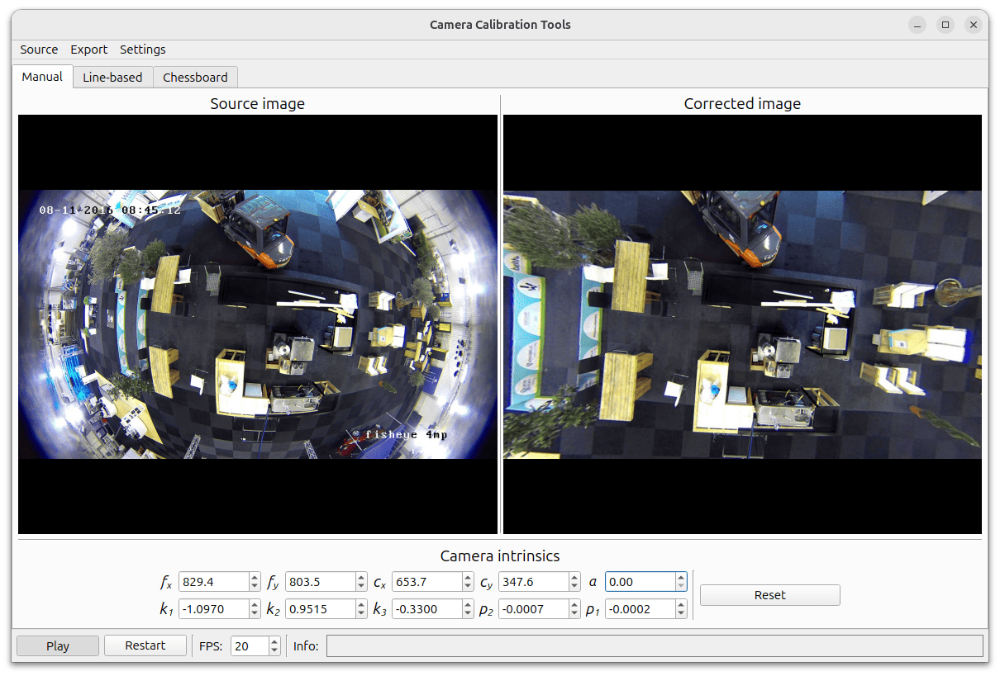
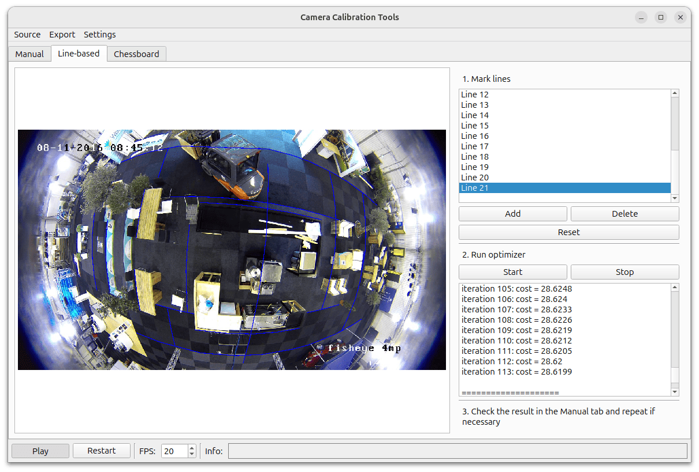
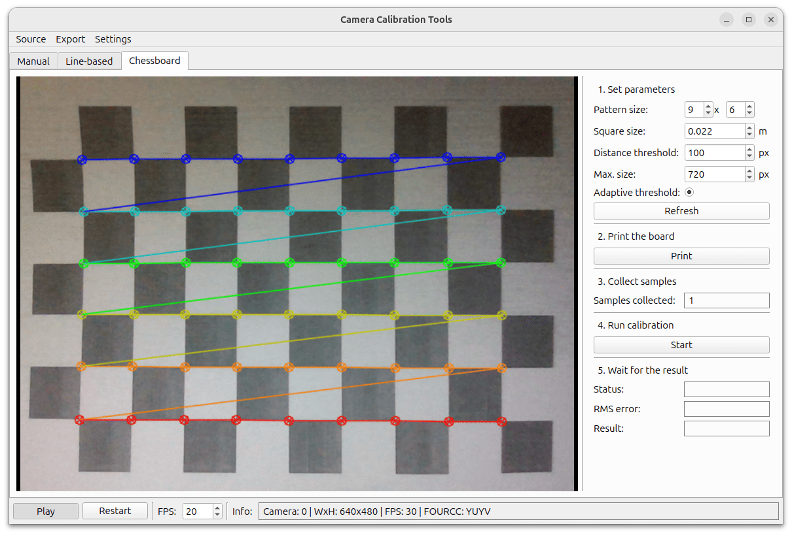

# Camera Calibration Tools

> [!Warning] This project is under development, and some features may be unstable.

A desktop application for simplifying camera calibration workflows, built with Qt.



## Features

- Camera calibration methods:
  - Manual
  - Line-based
  - Chessboard
- Interactive visualization of calibrated data
- Multiple input sources: files, built-in cameras, RTSP streams
- Export of calibration results
- Cross-platform: Linux and Windows

## Motivation

This tool was developed to calibrate a large number of dome cameras mounted high on ceilings, where using a standard chessboard pattern is impractical.
The cameras capture industrial spaces where many straight lines are present (e.g., floor tiles, structural beams).  

The approach is to manually annotate curved lines and then optimize the camera parameters to straighten them.
This program simplifies the process of manual annotation and line-based calibration. Over time, additional calibration methods were added for flexibility.

## Supported Calibration Methods

### Line-Based Calibration

Calibration is performed by optimizing camera parameters to straighten manually annotated curved lines in the scene.

**Typical use cases:**
- Industrial environments
- Scenes with prominent linear structures
- Situations where chessboard patterns cannot be used

Camera parameters are optimized using the [Ceres Solver](https://ceres-solver.org/).

> [!Note] Accurate line annotation is critical for good calibration results.



### Chessboard Calibration

Classic calibration using a planar chessboard pattern, leveraging standard OpenCV algorithms.

This method simplifies data collection and camera calibration in standard environments.



## Build

### Linux

Recommended build script:

```bash
cd camera_calibration_tools
./scripts/build.sh
```

Build artifacts will be located in the `artifacts` folder.
Required dependencies are listed in the [`dockerfile`](dockerfile).

Docker-based build and run are also supported:

```bash
cd camera_calibration_tools
docker compose up build

# Run the application via Docker
xhost +local:root
docker compose up run
```

### Windows

Dependencies are listed in the [`dockerfile`](dockerfile) and can be installed via MSYS2.
Build is recommended using MinGW and the same build script:

```bash
cd camera_calibration_tools
./scripts/build.sh
```

## Dependencies

This project relies on the following libraries:

* [Qt](https://www.qt.io/) – cross-platform C++ GUI framework
* [OpenCV](https://opencv.org/) – computer vision and image processing
* [Ceres Solver](https://ceres-solver.org/) – nonlinear least squares optimization

## Acknowledgements

This project was carried out with the support of and for the needs of [TASURT](https://tasurt.ru/).